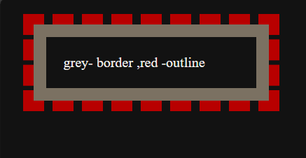

## 02. Learn Css Box Model

## Box Model
The CSS box model represents the structure of an HTML element as a rectangular box consisting of several layers: content, padding, border, and margin.

### Components of the Box Model
- **Content Box:** The area where the actual content (text, images, etc.) is displayed.
- **Padding Box:** The space between the content and the border. Padding increases the size of the box without affecting the surrounding elements.
- **Border Box:** The area surrounding the padding and content. Borders are visible and can have different styles, widths, and colors.
- **Margin Box:** The space outside the border. Margins create space between the current element and adjacent elements.

### Visual Representation


**CSS Box Model Properties and Values**

* **Content**: Defined by the actual content of the HTML element.
* **Padding**: Space between the content and the border.
  * *padding-top: 10px;*
  * *padding-right: 15px;*
  * *padding-bottom: 10px;*
  * *padding-left: 15px;*
  * *padding: 10px 15px; /* Shorthand for top/bottom and right/left */*
* **Border**: Surrounds the padding and content. Can have width, style, and color.
  * *border-width: 2px;*
  * *border-style: solid;*
  * *border-color: #000;*
  * *border: 2px solid #000; /* Shorthand */*
* **Margin**: Space outside the border. Creates distance between elements.
  * *margin-top: 20px;*
  * *margin-right: 30px;*
  * *margin-bottom: 20px;*
  * *margin-left: 30px;*
  * *margin: 20px 30px; /* Shorthand for top/bottom and right/left */*
* **Outline**: A line drawn outside the border to make an element stand out. Unlike borders, outlines do not affect the box's dimensions.
  * *outline-width: 1px;*
  * *outline-style: dashed;*
  * *outline-color: red;*
  * *outline: 1px dashed red; /* Shorthand */*
### See the differnce of border and outline




* **Box Sizing**: The box-sizing property determines how the width and height of an element are calculated.
  * box-sizing: content-box; [Default]
  * *box-sizing: border-box;*

**Example Code**

Here's an example demonstrating the CSS box model:

```html
<!DOCTYPE html>
<html lang="en">
<head>
    <meta charset="UTF-8">
    <meta name="viewport" content="width=device-width, initial-scale=1.0">
    <title>CSS Box Model Example</title>
    <style>
        .box {
            width: 200px;
            padding: 20px;
            border: 5px solid #333;
            margin: 30px;
            outline: 2px dashed red;
            box-sizing: content-box;
        }
          .box1 {
            width: 200px;
            padding: 20px;
            border: 5px solid #333;
            margin: 30px;
            outline: 2px dashed red;
            box-sizing: border-box; 
        }
    </style>
</head>
<body>
     <div class="box">
        This is without border box
    </div>
    <div class="box1">
        This is with border box
    </div>

</body>
</html>

```
- Here output is:
  


- If we inspect the output


- Conlusion is 
   - Content Box takes extra space than actual width and height
   - Border Box takes everything inside the actual width and height
